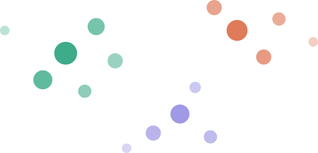

# IMBB Data Analysis workshop
## **I**nstitute of **M**olecular **B**iology and **B**iotechnology - FORTH, Heraklion, Crete
- ## **April 27 – May 7, 2026**
### *Mentoring and Career Track Scheme ([MCTS](https://www.imbb.forth.gr/en/content/Mentoring-and-Career-Track-Scheme.110/))*

A **hands-on** introduction to Python programming, data analysis, and computational biology for wet lab biologists.

---

## 🎯 Objectives

This workshop aims to:

- **Broaden data analysis understanding** in the institute
- **Demystify** computational methods  
- **Explain the logic** behind methods, not just how to run tools

This is an introductory boost — not a comprehensive training program. The goal is to get you started, familiarize you with code, and help you understand the concepts behind common analyses.

> *You'll learn how to code by coding yourself, not in the classroom.*

---

## 📚 Course Structure

### Week 1: Data Analysis Fundamentals ([CGLab](https://cgenomicslab.org/#members))
**Format:** 2-hour sessions daily, Monday–Thursday  
**Level:** Complete beginners  
**Dates:** April 27 – April 30  
**Time:** 10:00–12:00  

### Week 2: Specialized Topics in Genomics (IMBB bioinformatics/genomics experts)
**Format:** 2-hour sessions daily, Monday–Thursday  
**Level:** Complete beginners  
**Dates:** May 4 – May 7  
**Time:** 10:00–12:00  

---

## 🗓️ Week 1 Schedule

| Date | Room | Coordination | Topic | Material |
|------|------|---------------------|-------|----------|
| **Mon 27/4** — Day 1 | Orfanoudakis | [Alexandros Pittis](https://cgenomicslab.org/members/pittis/) | Python Fundamentals | [day1](week1/day1_python_fundamentals.ipynb) |
| **Tue 28/4** — Day 2 | Orfanoudakis | [Alexandros Pittis](https://cgenomicslab.org/members/pittis/) | Plotting & Data Exploration | [day2](week1/day2_plotting_data_exploration.ipynb) |
| **Wed 29/4** — Day 3 | Pagiatakis | [Alexandros Pittis](https://cgenomicslab.org/members/pittis/) | Statistics & P-values | [day3](week1/day3_statistics_pvalue.ipynb) |
| **Thu 30/4** — Day 4 | Pagiatakis | [Alexandros Pittis](https://cgenomicslab.org/members/pittis/) | Enrichment & Dimensionality Reduction | [day4](week1/day4_enrichment_dimensionality.ipynb) |

🪵🔥 **Thursday, April 30** (after Day 4, time TBD): BBQ 🍖🍗🥩🦴/🐙🦞🦪🦐 — everyone welcome!

---

## 🗓️ Week 2 Schedule

| Date | Room | Coordination | Topic | Material |
|------|------|---------------------|-------|----------|
| **Mon 4/5** — Day 5 | Pagiatakis | [Christos Andronis](https://www.imbb.forth.gr/en/facilities/Bioinformatics-Unit.15/&tabid=147&mid=Christos-Andronis.415) / [Electra Tsaglioti](https://www.imbb.forth.gr/en/facilities/Bioinformatics-Unit.15/&tabid=147&mid=Electra-Tsaglioti.437) ([Bioinformatics Unit](https://www.imbb.forth.gr/en/facilities/Bioinformatics-Unit.15/)) | Bulk RNA-seq analysis | [link](https://github.com/chandron/IMBB-rnaseq-workshop-1day) |
| **Tue 5/5** — Day 6 | Pagiatakis | [Ethan Baird](https://www.imbb.forth.gr/en/research/member-Ethan-Baird.419/&uid=58&tab=39) / [Vaso Theodorou](https://www.imbb.forth.gr/en/research/member-Vasiliki-Theodorou.126/&uid=58&tab=39) ([Delidakis lab](https://www.imbb.forth.gr/en/research/Christos-Delidakis.58/)) | Single-cell RNA-seq analysis | link |
| **Wed 6/5** — Day 7 | Pagiatakis | Orsalia Hazapis ([Talianidis lab](https://www.imbb.forth.gr/en/research/Iannis-Talianidis.75/)) | ATAC-seq | link |
| **Thu 7/5** — Day 8 | Pagiatakis | Instructors | Bring your data |  |

Week 2 links will be added here as they become available.

---

## 🪐 Remote (Zoom)

Links are the same **every day** for **each week**.

**Week 1** (Apr 27–30, 10:00 Athens)
[Join Meeting](https://us02web.zoom.us/j/85015061426?pwd=ST14pLRGibsESE3SPJKi1N3CyKcyJI.1)  
· Meeting ID: `850 1506 1426`  
· Passcode: `320451`

**Week 2** (May 4–7, 10:00 Athens)
[Join Meeting](https://us02web.zoom.us/j/82415393379?pwd=YjR4oNZ4FuWI63UGpeIjPWGRFlmPAu.1)  
· Meeting ID: `824 1539 3379`  
· Passcode: `038331`

---

## 🙌 Instructors

- [Maria Diamantaki](https://eflab.org/people/) — Froudarakis lab
- [Yiannis Pyrris](https://cgenomicslab.org/members/pyrris/) — CGLab
- [Amalia Kapsetaki](https://cgenomicslab.org/members/kapsetaki/) — CGLab
- [Iordana Zirdeli](https://cgenomicslab.org/members/zirdeli/) — CGLab
- [Kostis Paterakis](https://cgenomicslab.org/members/paterakis/) — CGLab
- [Athena Marouga](https://cgenomicslab.org/members/marouga/) — CGLab
- [Eva Delidaki](https://cgenomicslab.org/members/delidaki/) — CGLab
- [Melina Doudali](https://cgenomicslab.org/members/doudali/) — CGLab
- [Asterios Tsiftsis](https://cgenomicslab.org/members/tsiftsis/) — CGLab
- [Dimitris Papageorgiou](https://www.imbb.forth.gr/en/research/member-Dimitrios-Papageorgiou.332/&uid=61&tab=115) — Pavlopoulos lab
- Ioannis Giannoulakis - Talianidis lab
- Despoina Georgiadou - Bioinformatics MSc programme

---

## 🚀 Getting Started

### Prerequisites
- **No programming experience required**
- Laptop with admin rights for software installation

### Before Day 1
1. **Install Python and tools** — see [docs/SETUP.md](docs/SETUP.md)
2. **Go through the preparation notebooks** — see [precourse/](precourse/) (Python basics, and an R introduction for Week 2)

### Course Materials
All materials are in this repository:
- **week1/** — Jupyter notebooks for Week 1 (4 days)
- **precourse/** — Preparation notebooks (Python and R basics)
- **data/** — Datasets used throughout the course
- **docs/** — Setup instructions

---

## 💻 Technical Setup

**Recommended:** Python + Jupyter (VSCode optional) (see [docs/SETUP.md](docs/SETUP.md))

**Python packages (Week 1):** numpy, pandas, matplotlib, seaborn, scipy, scikit-learn, umap-learn

**R (Week 2):** Some Week 2 sessions use R. Install [R](https://cran.r-project.org) and [RStudio Desktop](https://posit.co/download/rstudio-desktop/) — see [docs/SETUP.md](docs/SETUP.md) Step 5 for details. 

**Alternatives:** Google Colab (browser-based, no installation) or IMBB JupyterHub (access provided during course, Python and R pre-installed).

---

## 👥 Target Audience

- IMBB-FORTH lab members (MSc students, PhD students, Postdocs, Technicians) with **no programming experience**

**Expected participants:** Up to 40

---

## 🤝 Course Coordination & Contributing Groups

**Coordination:** [CGLab (Alexandros Pittis)](https://cgenomicslab.org/)

**Contributing labs (tentative):** 
- [Bioinformatics Unit](https://www.imbb.forth.gr/en/facilities/Bioinformatics-Unit.15/) (Andronis)
- [Genome Integrity](https://imbb.forth.gr/en/research/Matthieu-Lavigne.70/)/[Genomics Facility](https://www.imbb.forth.gr/en/facilities/Genomics-Facility.13/&tabid=Home.84) (Lavigne)
- [Stem Cells](https://www.imbb.forth.gr/en/research/Christos-Delidakis.58/) (Delidakis)
- [Chromatin & Cancer Epigenetics](https://www.imbb.forth.gr/en/research/Iannis-Talianidis.75/) (Talianidis)

---

## 🔗 Additional Resources

**Python**
- [Python Graph Gallery](https://python-graph-gallery.com/) — the biggest collection of Python chart examples
- [Python lessons (in Greek)](https://github.com/kantale/python_lessons) by Alexandros Kanterakis (ICS-FORTH)
- [Pandas getting started tutorials](https://pandas.pydata.org/docs/getting_started/intro_tutorials/) — official pandas introduction
- [Seaborn documentation](https://seaborn.pydata.org/)

**Genomics**
- [RNA-seq analysis with DESeq2](https://bioconductor.org/packages/release/bioc/vignettes/DESeq2/inst/doc/DESeq2.html) — the standard bulk RNA-seq tutorial
- [Scanpy tutorials](https://scanpy.readthedocs.io/en/stable/tutorials.html) — single-cell RNA-seq in Python
- [Single-cell best practices](https://www.sc-best-practices.org/) — comprehensive single-cell analysis guide

---

## 📧 Contact & Support

**Course Coordinator:** [Alexandros Pittis](https://cgenomicslab.org/#contact) `alexandros.pittis@gmail.com` · [Comparative Genomics Lab](https://github.com/cgenomicslab) @ IMBB-FORTH, Heraklion, Crete

---

## 📝 Feedback

This is a living course that will improve with your input. After each session, we **welcome feedback on pace, clarity, and content**.
